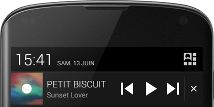
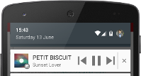
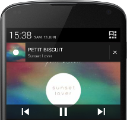
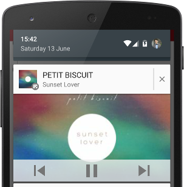

Cheerleader is an Android open source library designed to easily support an artist in an Android application thanks to a SoundCloud account. This project is developed by two Android enthusiasts during their free times.

# Cheerleader

[](http://search.maven.org/#search%7Cga%7C1%7Cg%3A%22fr.tvbarthel.cheerleader%22)
[](http://android-arsenal.com/details/1/1982)
[](https://play.google.com/store/apps/details?id=fr.tvbarthel.cheerleader.sampleapp)

The library is based on RxJava, if you aren't familiar with it, the following links are strongly recommended :
* [Official wiki](https://github.com/ReactiveX/RxJava/wiki)
* [Must-read tutorials written by Dan Lew](http://blog.danlew.net/2014/09/15/grokking-rxjava-part-1/)

The library is composed of two main classes :
- the client : [CheerleaderClient](#cheerleaderclient);
- the player : [CheerleaderPlayer](#cheerleaderplayer);

# Summary
* [Why Cheerleader?](#why-cheerleader?)
* [Disclaimer](#disclaimer)
* [Gradle Dependency](#gradle-dependency)
* [CheerleaderClient](#cheerleaderclient)
* [CheerleaderPlayer](#cheerleaderplayer)
* [TODO](#todo)
* [Methods Count](#methods-count)
* [Contributing](#contributing)
* [Credits](#credits)
* [License](#license)
* [Special Thanks...](#special-thanks-to-)

# Why Cheerleader?

[Find out our motivations.](http://tvbarthel.fr/Cheerleader/)

# Disclaimer
Cheerleader is a open-source library developped by two Android enthusiasts during their spare time. Cheerleader is provided "as it" and may present a few bugs on some smartphones. Please, feel free to show your support to this open-source project by leaving your feedback.

Don't forget to read the [SoundCloud terms of use](https://developers.soundcloud.com/docs/api/terms-of-use).

Please keep in mind that the main goal of this project is to help independent artists reach more fans and bring more visibility through an Android application. If you plans to monetize your app (please don't use Ads), check the [Commercial Use](https://developers.soundcloud.com/docs/api/terms-of-use#commercial) section and be sure to pays the artist and SoundCloud for bringing diversified musics for free.

# Gradle Dependency
Promoted on Maven Central : 

```java
compile 'fr.tvbarthel.cheerleader:library:0.1.1'
```

# CheerleaderClient 
As any client, the CheerleaderClient will provide a bridge between your app and the data stored on the SoundCloud servers.

Severals features have been implemented to avoid too many access to the SoundCloud API as well as trying to provide a better user experience : 
- Data will be cached in RAM as long as the client isn't closed (artist and tracks data are unlikely to change every minutes).
- Response will be stored in a local database for offline usage (see "download track" feature in the TODO list for complete offline mode support).

## Builder 
```java
  mCheerleaderClient = new CheerleaderClient.Builder()
            .from(context)
            .with(R.string.sound_cloud_client_id)
            .supports("artistToSupportName")
            .build();
```
Note that only one artist can be supported at the same time, any new attempt to build a new client for another artist will automatically close the old one.

##Features
Currently, only few features are available. Have a look to the TODO section to check incomming features.

### Artist's profile
Once a client has been build for a given artist, the complete SoundCloud profile can be retrieved (name, avatar url, description, followers count, etc.) : 

```java
  mCheerleaderClient.getArtistProfile()
            .subscribeOn(Schedulers.io())
            .observeOn(AndroidSchedulers.mainThread())
            .subscribe(new Action1<SoundCloudUser>() {
                @Override
                public void call(SoundCloudUser soundCloudUser) {
                    
                }
            });
```

### Artist's tracks
Public tracks of the supported artist are also available (title, artwork url, duration, wave form url, etc.) : 

```java
  mCheerleaderClient.getArtistTracks()
            .subscribeOn(Schedulers.io())
            .observeOn(AndroidSchedulers.mainThread())
            .subscribe(new Action1<ArrayList<SoundCloudTrack>>() {
                @Override
                public void call(ArrayList<SoundCloudTrack> soundCloudTracks) {
                    
                }
            });
```

### Comments
In addition, comments of a given track can be retrieved : 

```java
  mCheerleaderClient.getTrackComments(track)
            .subscribeOn(Schedulers.io())
            .observeOn(AndroidSchedulers.mainThread())
            .subscribe(new Action1<ArrayList<SoundCloudComment>>() {
                @Override
                public void call(ArrayList<SoundCloudComment> soundCloudComments) {
                    
                }
            });
```

## Debug
Designed to simplify the implementation of the library, we kept the possibility to display some logs in the LogCat : 
```java
  mCheerleaderClient = new CheerleaderClient.Builder()
            .from(context)
            .with(R.string.sound_cloud_client_id)
            .log(CheerleaderClient.LOG_OFFLINER)
            .supports("artistToSupportName")
            .build();
```

Note that a pipe can be used to chain log levels.

# CheerleaderPlayer
The player encapsulate the whole playback logic including :
- An internal playlist;
- Notification, small and expanded (Artist name, track title, track artwork, actions -play, pause, previous, next-);
- Lock screen enhancement while playing (track artwork);
- Audio focus compliant (pause when headset is unplugged, pause/resume while hanging up the phone, etc.);
- Support of third app equalizer. 

## Builder
```java
  mCheerleaderPlayer = new CheerleaderPlayer.Builder()
            .from(this)
            .with(R.string.sound_cloud_client_id)
            .build();
```

### Notification
By default, no pending intent is attached to the notification.  In order to link your player activity just add the following lines to the Builder :
```java
  mCheerleaderPlayer = new CheerleaderPlayer.Builder()
            .from(this)
            .notificationActivity(PlayerActivity.class)
            .notificationIcon(R.drawable.ic_notification)
            .notificationIconBackground(R.drawable.notification_ic_background)
            .with(R.string.sound_cloud_client_id)
            .build();
```
Note that small icon as well as small icon background (Lollipop only) can also be customized through the Builder.

**Overview**

| Pre-Lollipop | Post-Lollipop |
|:-:|:-:|
| [](./static/notifications/nexus4_collapsed.png) | [](./static/notifications/nexus5_collapsed.png)
| [](./static/notifications/nexus4_expanded.png) | [](./static/notifications/nexus5_expanded.png)


## Player interface
The public interface of the Player should allow to perform all actions expected from a player. 

```java
   mCheerleaderPlayer.addTrack(track, playNow);
   ...
   mCheerleaderPlayer.togglePlayback();
   ...
   mCheerleaderPlayer.previous();
   ...
   mCheerleaderPlayer.next();
   ...
   mCheerleaderPlayer.seekTo(milli);
   ...
   mCheerleaderPlayer.isPlaying();
   ...
   mCheerleaderPlayer.getCurrentTrack();
   ...
   
```

Check the java doc as well as the sample for more information on any variants of the methods above.

## Player Listener
In order to provide meaningfull callback to the user, two diferent kinds of listener can be registered.

### CheerleaderPlayerListener
Listener used to catch any events related to the playback including thoses from the notification / lockscreen controller.
```java
  /**
     * Called when a track starts to be played.
     *
     * @param track    played track.
     * @param position position of the played track in the playlist.
     */
    void onPlayerPlay(SoundCloudTrack track, int position);

    /**
     * Called when a the player has been paused.
     */
    void onPlayerPause();

    /**
     * Called when the player complete a seek action.
     *
     * @param milli time in milli of the seek.
     */
    void onPlayerSeekTo(int milli);

    /**
     * Called when the player has been destroyed.
     */
    void onPlayerDestroyed();

    /**
     * Called when the player paused due to buffering more data.
     */
    void onBufferingStarted();

    /**
     * Called when the player resumed after having buffered enough data.
     */
    void onBufferingEnded();

    /**
     * Called when current position time changed.
     *
     * @param milli current time in milli seconds.
     */
    void onProgressChanged(int milli);
```

See also ```java mCheerleaderPlayer.registerPlayerListener(listener) ``` and ```java mCheerleaderPlayer.unregisterPlayerListener(listener) ```

### CheerleaderPlaylistListener
A second listener used to catch any events performed on the internal playlist.

```java 
    /**
     * Called when a tracks has been added to the player playlist.
     *
     * @param track track added.
     */
    void onTrackAdded(SoundCloudTrack track);


    /**
     * Called when a tracks has been removed from the player playlist.
     *
     * @param track   track removed.
     * @param isEmpty true if the playlist is empty after deletion.
     */
    void onTrackRemoved(SoundCloudTrack track, boolean isEmpty);
```
See also ```java mCheerleaderPlayer.registerPlaylistListener(listener) ``` and ```java mCheerleaderPlayer.unregisterPlaylistListener(listener) ```

# TODO
* Add the possibility to download the tracks localy.
* Support Android Wear notification.
* Support Android Auto.
* Support Chromecast.

# Methods Count
```java
    |cheerleader 569
    |    |client 252
    |    |player 199
    |    |offline 51
    |    |media 28
    |    |remote 22
    |    |helpers 2
```

# Contributing
Contributions are welcome (: You can contribute through GitHub by forking the repository and sending a pull request.

When submitting code, please make every effort to follow existing conventions and style in order to keep the code as readable as possible. For this project, we tries to follow the [code style guidelines of the Android open source project](https://source.android.com/source/code-style.html).

Don't forget to run ``` gradlew :library:check ``` to ensure static analysis tools won't break the build.

# Credits
Credits go to Thomas Barthélémy [https://github.com/tbarthel-fr](https://github.com/tbarthel-fr) and Vincent Barthélémy [https://github.com/vbarthel-fr](https://github.com/vbarthel-fr) as well as [The SoundCloud API Team](mailto:api@soundcloud.com) for providing an API which allow the developers to build apps upon their services.

# License
Copyright (C) 2015 tvbarthel

Licensed under the Apache License, Version 2.0 (the "License");
you may not use this file except in compliance with the License.
You may obtain a copy of the License at

    http://www.apache.org/licenses/LICENSE-2.0

Unless required by applicable law or agreed to in writing, software
distributed under the License is distributed on an "AS IS" BASIS,
WITHOUT WARRANTIES OR CONDITIONS OF ANY KIND, either express or implied.
See the License for the specific language governing permissions and
limitations under the License.

# Special Thanks to ...
(Ivan B)[https://twitter.com/ivanbnw) , for his daily support and motivation through his lyrics.
